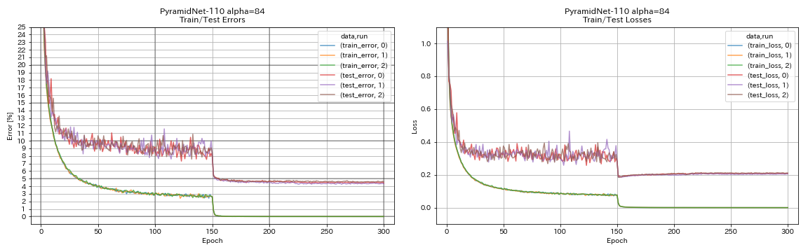
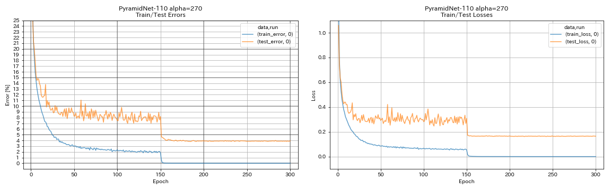

# PyTorch Implementation of PyramidNet

## Usage

```
$ python main.py --block_type basic --depth 110 --alpha 84 --outdir results
```

## Results on CIFAR-10

| Model                                 | Test Error (median of 3 runs) | Test Error (in paper) | Training Time |
|:--------------------------------------|:-----------------------------:|:---------------------:|--------------:|
| PyramidNet-110 (alpha=84)             | 4.40                          | 4.26 ± 0.23          |  11h40m       |
| PyramidNet-110 (alpha=270)            | 3.92 (1 run)                  | 3.73 ± 0.04          |  24h12m*      |
| PyramidNet-164 bottleneck (alpha=270) |                               | 3.48 ± 0.20          |               |
| PyramidNet-272 bottleneck (alpha=200) |                               | 3.31 ± 0.08          |               |




## References

* Han, Dongyoon, Jiwhan Kim, and Junmo Kim. "Deep pyramidal residual networks." The IEEE Conference on Computer Vision and Pattern Recognition (CVPR), 2017, pp. 5927-5935. [arXiv:1610.02915]( https://arxiv.org/abs/1610.02915 ), [Torch implementation]( https://github.com/jhkim89/PyramidNet ), [Caffe implementation]( https://github.com/jhkim89/PyramidNet-caffe ), [PyTorch implementation]( https://github.com/dyhan0920/PyramidNet-PyTorch )


